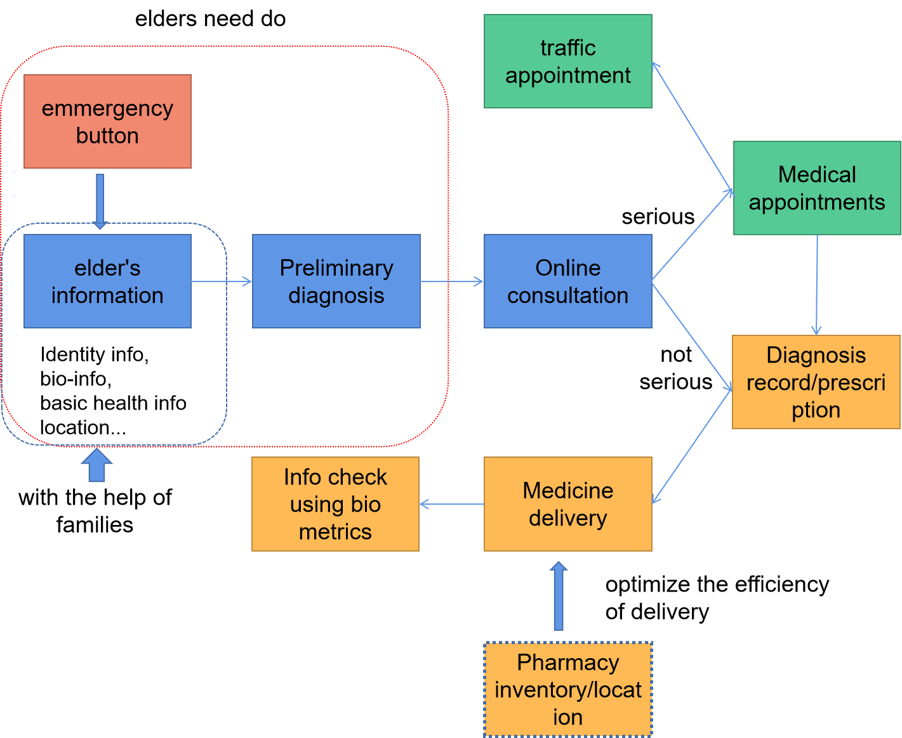
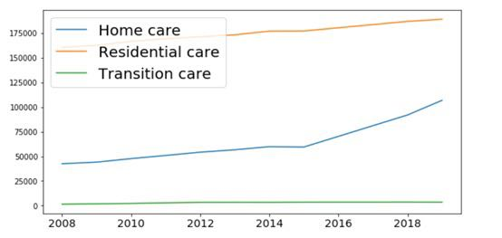
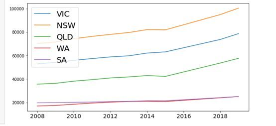

# Plus61
💻The data resources, prototype, videos for GovHack 2020

## 💡Mind Graph:

## 🎞Introduction Video:
https://www.powtoon.com/s/fvpFfmAhFK7/1/m

## 🚲Prototype:
User end:  
https://modao.cc/app/1adfd43c7be18bb80bd39a8f401cc337b95ccae4?simulator_type=outside_artboard&sticky
Doctor end:  
https://modao.cc/app/d0edb08644d50203dee840ff4c600f5e8e4e32a6?simulator_type=outside_artboard&sticky

## 📊Tableau Visualization
https://public.tableau.com/profile/masoom.patel#!/vizhome/billions_saved_govhack/GovHack?publish=yes

## 📃Google File:
https://docs.google.com/spreadsheets/d/1VAp4jPH8HeI9AGZsCGrvxGtzUAFZmNkaXpyi2igB4pQ/edit?usp=sharing

 
## ✏Basic data analyze, visualization and conclusion
 

 
- Conclusion By Lingzhi：
 
It shows a trend that older people need more supportive aged care services. There is also a shift to home care services from institutionalised care. Due to the huge population in NSW, there is no doubt that NSW has the most demand in aged care.It would be a good idea to allocate funding and resources to home care institution and facility.

 
Aged care user experience.xls
 
- Conclusion By Yixuan：
 
I mainly looked into old people's user experience in the aged care institutions. Based on the data we acquired, it's clear that for old people with serious life disability like, mobility difficulty, Alzheimers, there is still very large portion of that group holding a neutral (neither satisfied nor dissatisfied) attitude to the service of aged care institutions. That supports our thought to develop such a App.
