# Plus61
 
 
# HomePage
 
https://govhack-plus61.github.io/Plus61/
 
 

## 🎞Introduction Video:
https://www.youtube.com/watch?v=DRQ9B_Xe6V4

## 📃Software Design Description:
https://docs.google.com/document/d/1jfTuS7_kJKLwCHeCc9loW6zLhLrwf3_AUQ-ydy92nqw/edit

## 🚲Prototype:
User end:  
https://modao.cc/app/1adfd43c7be18bb80bd39a8f401cc337b95ccae4?simulator_type=outside_artboard&sticky
 Doctor end:  
https://modao.cc/app/d0edb08644d50203dee840ff4c600f5e8e4e32a6?simulator_type=outside_artboard&sticky

## 📊Tableau Visualization
Millions Saved (Population and expenditure): 
https://public.tableau.com/profile/masoom.patel#!/vizhome/millions_saved_govhack/GovHack?publish=yes 
 
Mobility Patient Response: 
https://public.tableau.com/profile/masoom.patel#!/vizhome/MobilityPatientResponse_GovHack/MobilityPatientsDashboard?publish=yes
 
Alzheimer Patient Response: 
https://public.tableau.com/profile/masoom.patel#!/vizhome/AlzheimerPatientResponse_GovHack/AlzheimerPatientsDashboard?publish=yes

# Introduction
## Demand Background
In 2017, there were 3.8 million Australians aged 65 and over, comprising 15% of the total population. In the year ending 30 June 2019, the number of people aged 65 years and over increased by 125,400 people (or 3.2%). Over the twenty years between 1999 and 2019, the proportion of the aged population has increased from 12.3% to 15.9%. 
 
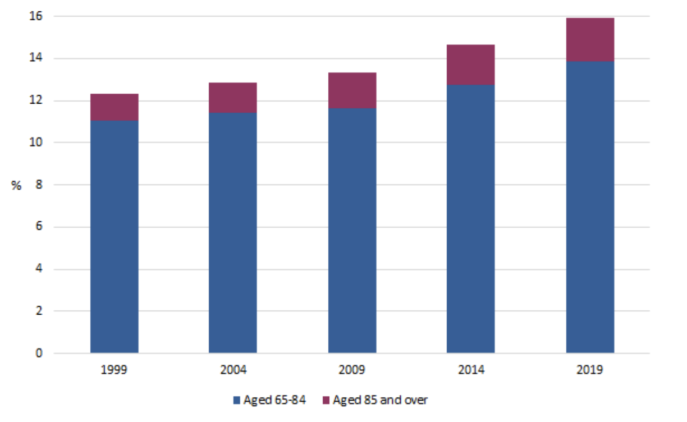
 
However, the bed ratio per 1000 people aged 65 continues to decline. The resources allocated for aged people demonstrated a decreasing trend, as the picture shows below.
 
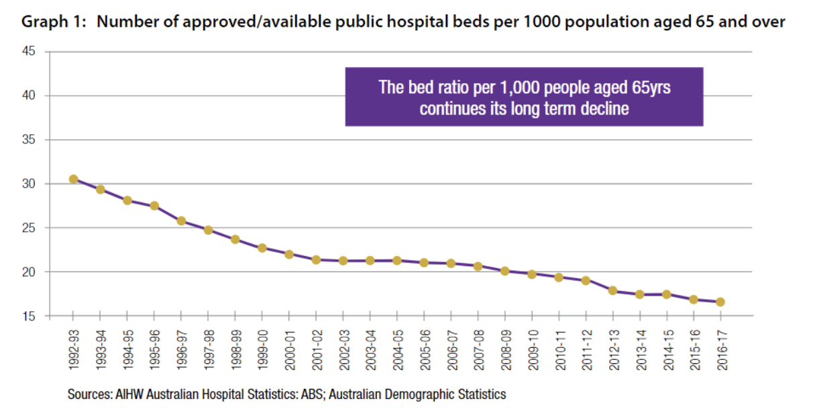
 
(from https://gen-agedcaredata.gov.au/Topics/Care-needs-in-aged-care) 
With aged people increasing and hospital beds for aged people decreasing, the aged care market exists a sharp maldistribution. Due to the gap between medical demand and supply, there is an increasing need to add more resources to aged care, especially in the background of Covid-19. Home care is a great way to achieve this.
 
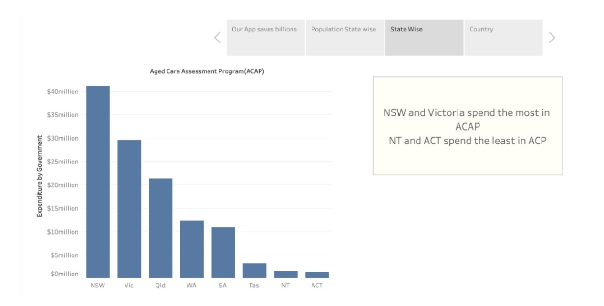
 
from https://ama.com.au/sites/default/files/public-hospital-report-cards/AMA%20Public%20Hospital%20Report%20Card%202019.pdf
 
Looking back to the aged care type, there are generally three types, including home care, residential care, and transition care.  In the graph below shows that home care has a rapidly increasing trend. Combined with the picture of aged people distribution,It shows a trend that older people need more supportive aged care services. There is also a shift to home care services from institutionalised care. Due to the huge population in NSW, there is no doubt that NSW has the most demand in aged care. It would be a good idea to allocate funding and resources to home care institutions and facilities.
 
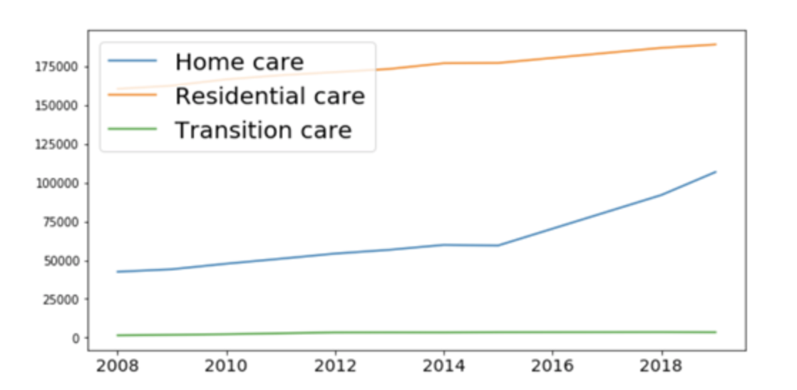
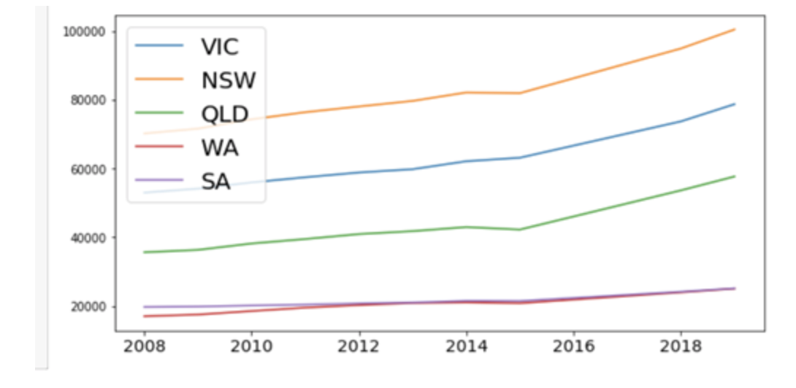
 
Although the elder spend a lot of money in aged care institutions, the user experience doesn't go as expected. We analyzed data from a questionnaire investigation and focused on how the elder rate the service over 9 question dimensions.
 
 
By looking into customers with serious life disabilities, like the mobility restricted group, and the Alzheimer group, we found that around 20% of two groups hold a neutral attitude towards the service they received, that is neither love it nor dislike it. 
 
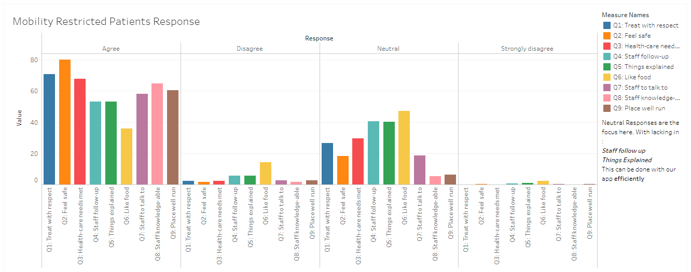
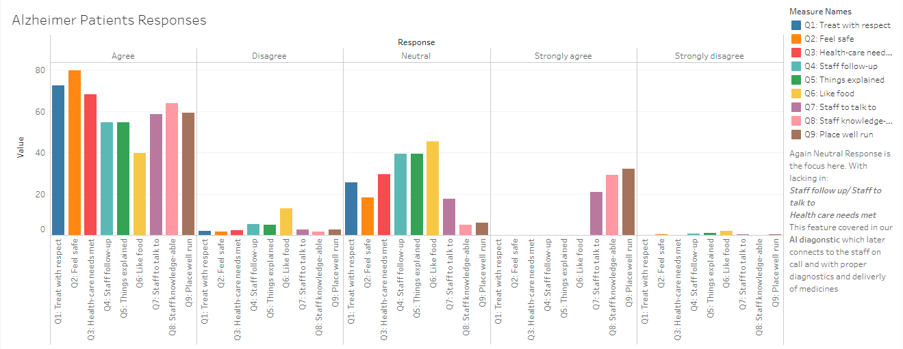
 
So it is clear that the service of aged care centers cannot fulfill all the needs of the elder, which is why we had the idea to develop the CareMate App.
 
## Health issues
There is research showing that 53% of people in permanent residential aged care had a diagnosis of dementia. 49% of people in permanent residential aged care had a diagnosis of depression. It is deduced that receiving aged care at home is more healthy and friendly than residential care.
## Ecommerce
Australian ecommerce market is expanding promptly. The market size will rise from A$28.6 billion in 2019 to A$35.2 billion by 2021. In addition, the user penetration in the ecommerce market will be at 71.7% in 2020. More and more people are choosing shopping online, with their parcels delivered straight home.
 

 
## Covid-19 pandemic
Due to the social distancing rule, using medicine deliveries instead of going to the hospital is safer.

# Architectural and component-level design
This App has two ends, one for clients and another for business. Users use the client version to place orders, consult with AI doctors, and so on. Hospitals or clinics use business end to receive orders and fulfill customer requirements.
 
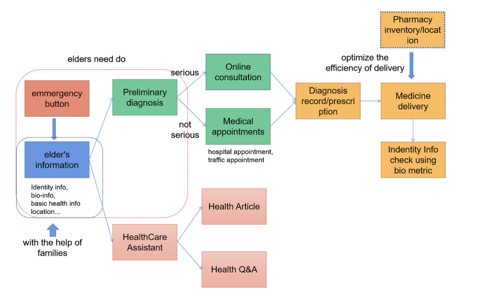
 

# User interface design
## User end
Modao prototype  
 
Source of Health Articles in our APP  
https://www.sharecare.com/static/health-articles
 
 
Graph 3-1 shows the home page. There is some basic information about the elder, including name, age, sex, disease history, address and bioinformation, such as fingerprint and face image. And there is also an Emergency button where elder can click whenever he or she faces an emergency. This emergency button is much more convenient since the basic information and medical records stored in APP, as shown as Graph 3-9, can help doctors to understand elder’s condition efficiently. 
 
 
Graph 3-2 shows two functions in the Medical modules, Online Doctor and HealthCare Assistant. Graph 3-3 to Graph 3-4 shows the function of HealthCare Assistant. Elders are always interested in health knowledge, but there is too much news of pseudoscience. Therefore, HealthCare Assistant will provide scientific health articles and a platform to ask health questions. Graph 3-5 to Graph 3-7 are interfaces of Online Doctor. Through Preliminary Diagnosis function, the AI doctor trained by disease symptom dataset will preliminary classify diseases and diagnose the severity of disease. If the elder is in a not serious situation, a doctor will detailedly diagnose and prescribe medicine via online consultant.  If in a serious situation, the APP will automatically appoint a hospital and traffic for elder to get face-to-face treatment as soon as possible. 
 
 
After the diagnosis, the medicines prescribed by the doctor will be delivered to the elder’s house through the Medical Delivery function. Our APP collects location information of pharmacies from map databases and other features of pharmacies, such as inventory and optimizes the best delivery schema in order to deliver medicines efficiently. When medicines are delivered, the biometric information, such as face image or fingerprint can be used for identification.
 
 
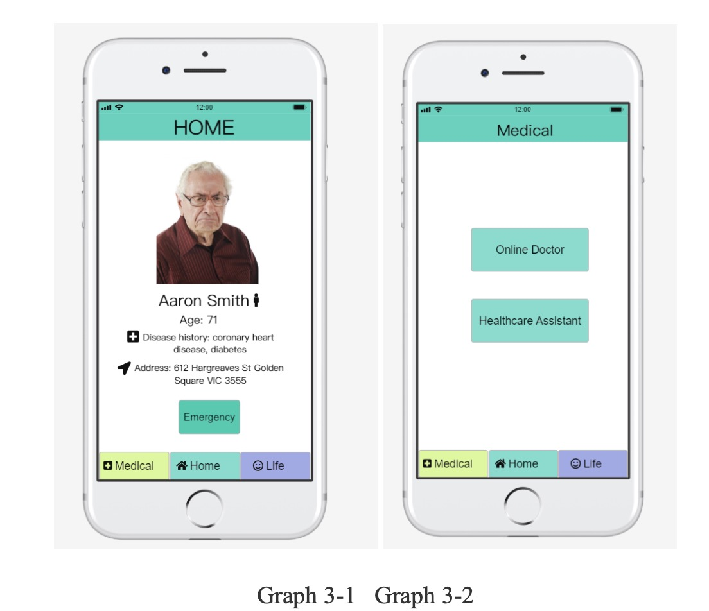
 
Graph 3-1 shows the home page. There is some basic information about the elder, including name, age, sex, disease history, address and bioinformation, such as fingerprint and face image. And there is also an Emergency button where elder can click whenever he or she faces an emergency. This emergency button is much more convenient since the basic information and medical records stored in APP, as shown as Graph 3-9, can help doctors to understand elder’s condition efficiently. 
 
 
Graph 3-2 shows two functions in the Medical modules, Online Doctor and HealthCare Assistant. Graph 3-3 to Graph 3-4 shows the function of HealthCare Assistant. Elders are always interested in health knowledge, but there is too much news of pseudoscience. Therefore, HealthCare Assistant will provide scientific health articles and a platform to ask health questions. Graph 3-5 to Graph 3-7 are interfaces of Online Doctor. Through Preliminary Diagnosis function, the AI doctor trained by disease symptom dataset will preliminary classify diseases and diagnose the severity of disease. If the elder is in a not serious situation, a doctor will detailedly diagnose and prescribe medicine via online consultant.  If in a serious situation, the APP will automatically appoint a hospital and traffic for elder to get face-to-face treatment as soon as possible. 
 
 
After the diagnosis, the medicines prescribed by the doctor will be delivered to the elder’s house through the Medical Delivery function. Our APP collects location information of pharmacies from map databases and other features of pharmacies, such as inventory and optimizes the best delivery schema in order to deliver medicines efficiently. When medicines are delivered, the biometric information, such as face image or fingerprint can be used for identification.
 
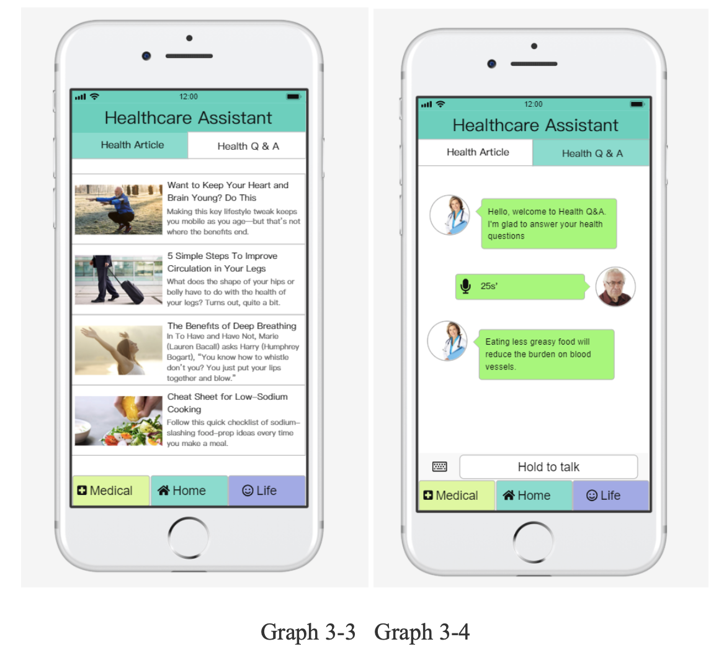
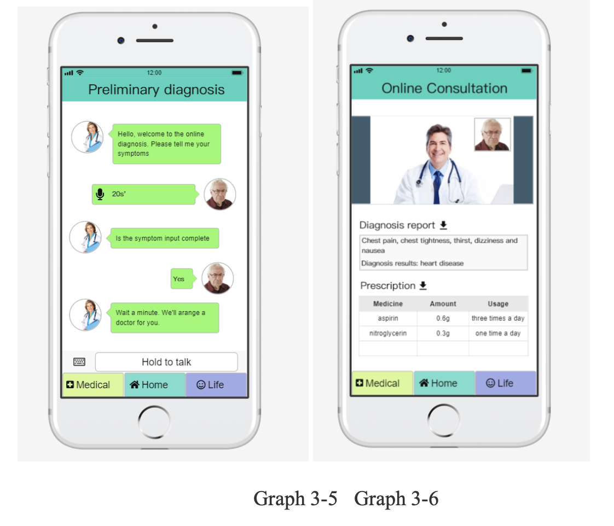
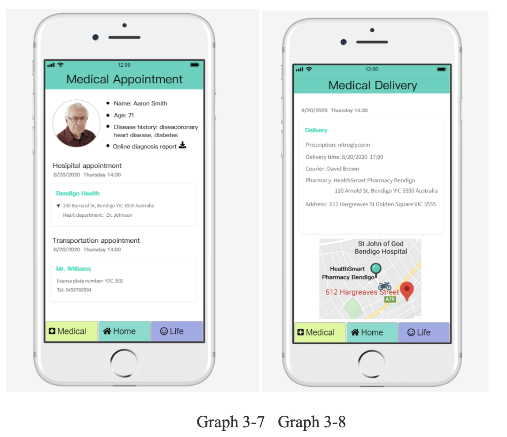
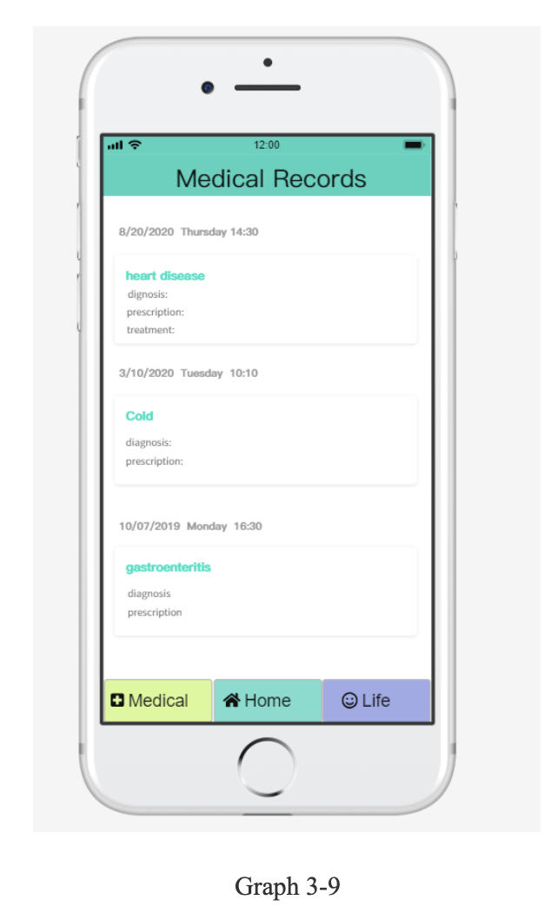
 
## Doctor end
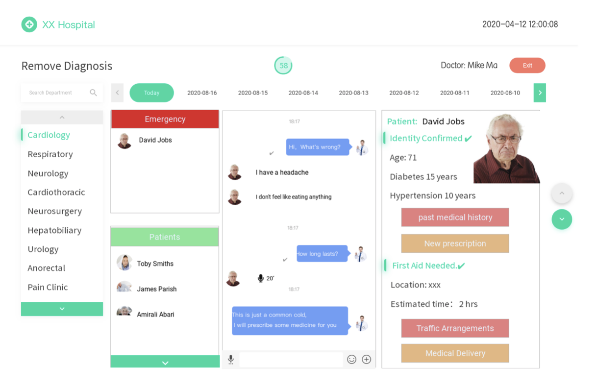
 
The doctor side of CareMore would be deployed in the hospital. The emergency and normal patients list would appear on the left. The doctor could choose a patient and do online consultation in the dialog. 
 
 
After the patient completes the identification confirmation, the doctor can view the current patient’s basic information, past medical records, and prescribe medication on the right. If the doctor thinks that the elderly need to go to the hospital, they can click the ‘traffic arrangement’ button to provide dedicated route support. The doctor could also click the ’medical delivery’ button to notify a courier deliver the drugs for the elderly, and the drugs would be sent to the patient directly.
 

 
Dataset below info:
 
 
Disease Symptoms: dataset, symptoms x3 excel files （app_data）
 
 
Visualisation (Population and Expenditure): rogs excel file (basic_data)
 
 
Patient Responses Visualisation: aged care user experience excel file (analyze_data)
 
 
 
Link to datasets:
 
 
https://www.aihw.gov.au/reports/australias-welfare/aged-care
 
 
https://www.pc.gov.au/research/ongoing/report-on-government-services/2018/community-services/aged-care-services
 
 
https://www.kaggle.com/itachi9604/disease-symptom-description-dataset  

